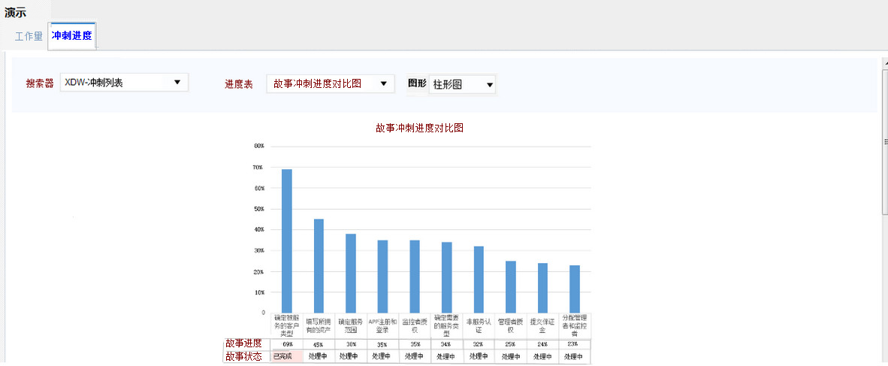
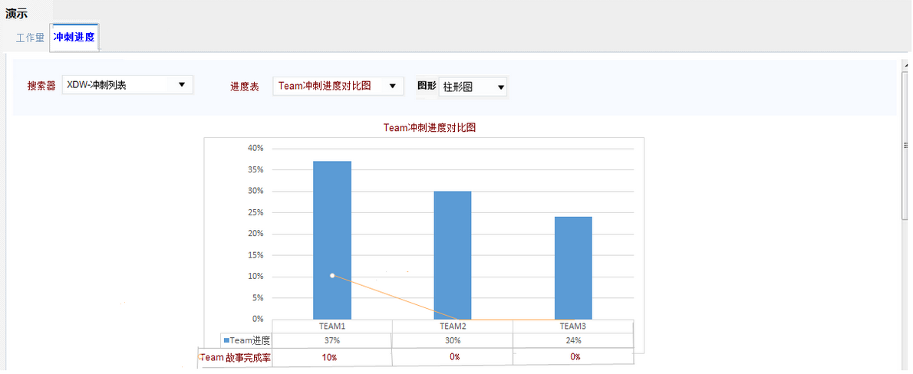

> 故事进度报表

进度表有两幅图：故事冲刺进度对比图和Team冲刺总进度图    

# 故事冲刺进度对比图：  

  

1、该图显示的是当前冲刺中包含的所有父任务（用户故事、技术特性、技术债等）对应的进度百分比值； 同时能显示状态（并且当完成时能自动以颜色区分）  
2、从左到右自动按进度百分比自高而低排列；  

# eam冲刺进度对比图：

1、Team进度：按照team的维度（或SPRINT的维度）对数据进行分类处理；如team1对应的是team1-sprint2的数据汇总，得出team的进度百分比；  
2、Team故事完成率：按照team的维度（或SPRINT的维度）对数据进行分类处理
故事完成率=team已完成的故事点数/team的故事点总数