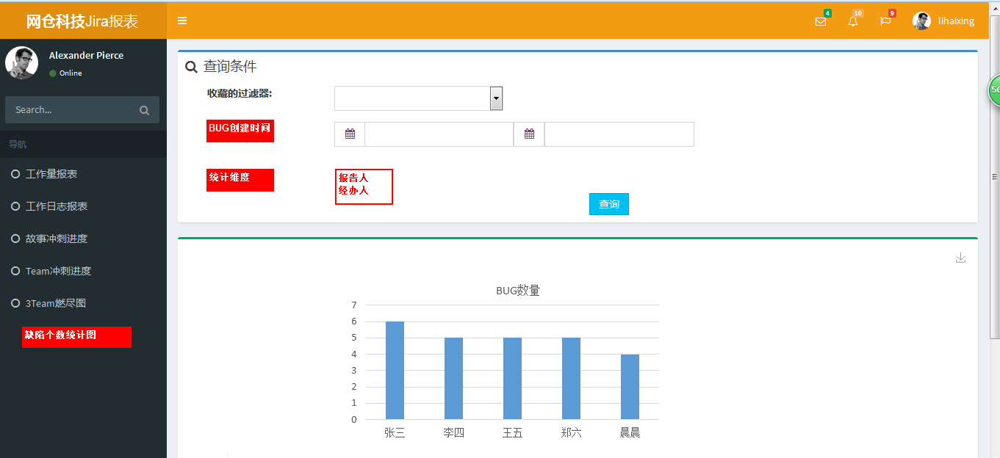
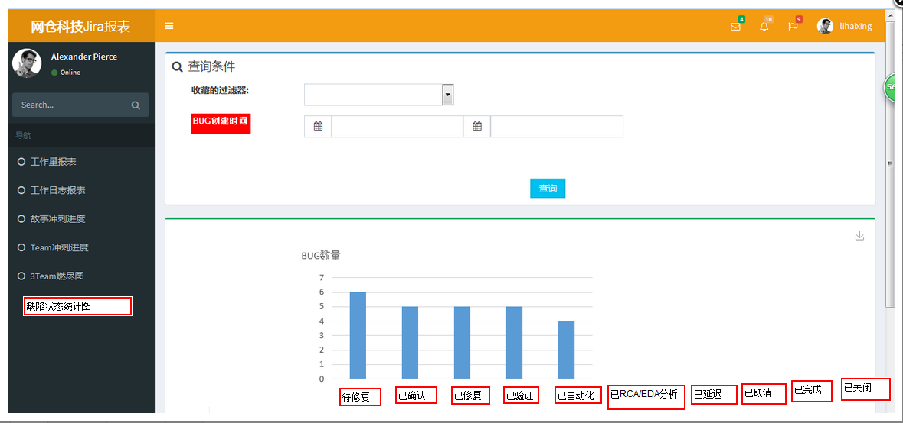

> 测试缺陷统计报表

1、测试缺陷数量统计报表

BUG创建时间：即能以bug的创建时间进行区间选择；  
统计维度：可以按报告人的维度进行统计（目的是统计发现人的bug数量），也可以按经办人的维度进行统计（目的是统计解决人的bug数量）；  
图表按数量多到少自动排序；

2、测试缺陷状态统计报表  

收藏的过滤器：能以自定义的过滤器进行搜索（主要会是针对生产缺陷、内测缺陷的搜索结果）  
BUG创建时间：即能以bug的创建时间进行区间选择；  
支持柱状图和圆饼图两种显示方式；  
能自动显示不同状态所对应的bug数量；  

